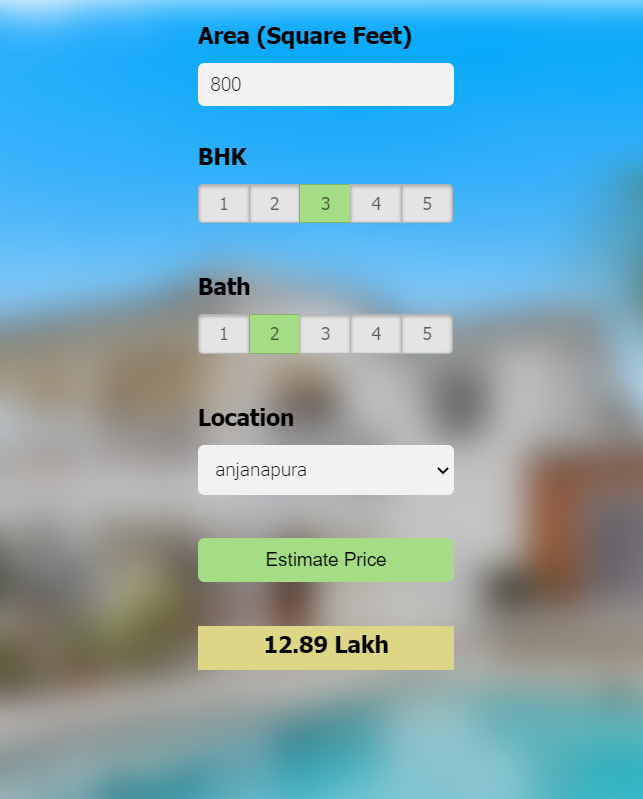

# House-Price-Predicting
Machine Learning project predicting real estate prices created with python, scikit-learn, python flask and java script.

## Introduction
The aim of the project was to learn the whole process of Machine Learning project from preprocessing to deploying to AWS. It solves the problem of real estate pricing. It is based on square feet, number of bathrooms and rooms (here called BHK) and location of real estate.

## Technologies
* Python 3.8.2
* Python Flask 1.1.2
* Numpy 1.18.3
* Pandas 1.0.3
* Sklearn 0.23.0
* Matplotlib 3.2.1
* HTML5
* CSS
* Javascript 1.7

## Feature
By providing details of a real estate: area, BHK (no. of rooms), no. of bathrooms, location and clicking the button "Estimate price" a user is given a estimated price of the real estate. 

## Launch
Firstly run the server.py and then open the app.html.

## Sources 
The project was based on the @codebasics' YouTube tutorial. 
